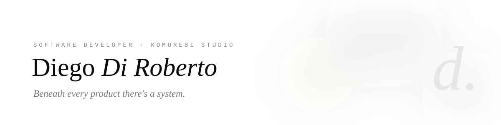

<picture>
  <source media="(prefers-color-scheme: dark)" srcset="assets/banner-dark.svg">
  
</picture>

  
  
  
  
  
  
  
  
  

**Full Stack Developer & AI Engineer**, freelance under Komorebi Studio.

Beneath every product there's a system. I turn complex processes into simple systems, for teams that want quality, not hype: architectures that hold up, clean interfaces, AI where it actually helps.

Since 2018 I've built products, infrastructure, and AI systems across healthcare, fintech, IoT, sports, and media. I studied computer science, then fine arts; both live in everything I build.

## The numbers

<picture>
  <source media="(prefers-color-scheme: dark)" srcset="assets/numbers-dark.svg">
  
</picture>

Mostly private client repos; the public graph undercounts the interesting parts.

## What I do

- **AI & Automation**: systems based on LLMs and AI agents that automate repetitive work and internal processes
- **Software Development & Architecture**: backend, frontend, and real-time systems for products that need to last and grow without collapsing
- **Technical Advisory**: a direct sounding board on stack, architecture, and technical roadmap. Honest opinions, explicit trade-offs.

## Selected work

Systems in production, not demos. Mostly private client work; full stories on [diegodiroberto.com](https://diegodiroberto.com/en/projects):

- **Medical report digitization & analysis**: 600,000 sensitive documents digitized, anonymized, and enriched with tags and KPIs, plus interactive dashboards and an AI assistant for natural-language queries
- **Tradepick**: B2B AI lead-generation service, run by agent crews that find target companies, score the fit, and surface the right contacts for targeted campaigns
- **Video-first job-matching platform**: end-to-end build, from backend and frontend to infrastructure. Workers introduce themselves with selfie videos; AI analysis extracts the data that lets workers and employers find each other faster.
- **Real-time backend for live sports data**: infrastructure for a national publication, built for traffic spikes during live events with millions of users

## Stack

- **Backend**: Python first (Django, real-time data pipelines), comfortable across all the major languages and frameworks
- **Frontend**: TypeScript, React, Next.js, Tailwind CSS
- **AI**: LLM-based systems and AI agent crews, in production since the early GPT days. Document extraction, embedding and reranking pipelines, self-hosted open-source text and vision models on NVIDIA GPUs.
- **Infrastructure**: Docker and Docker Compose on every project; Terraform to stay portable across the major cloud providers

## How I work

- **Architecture first**: systems designed to last, not to demo
- **Code you can read**: the next developer (often future me) matters
- **Decisions in the open**: every technical choice comes with its "why"

Got a project in mind? The fastest route is a [30-minute call](https://calendly.com/diroberto-diego/30min).

## Elsewhere

- 🌐 [diegodiroberto.com](https://diegodiroberto.com)
- 💼 [LinkedIn](https://www.linkedin.com/in/diegodiroberto/)
- 📸 [Instagram](https://www.instagram.com/diegodirob/)
- 📅 [Book a 30-minute call](https://calendly.com/diroberto-diego/30min)

---

Komorebi: sunlight filtering through leaves. A reminder to look for simplicity in everything.
